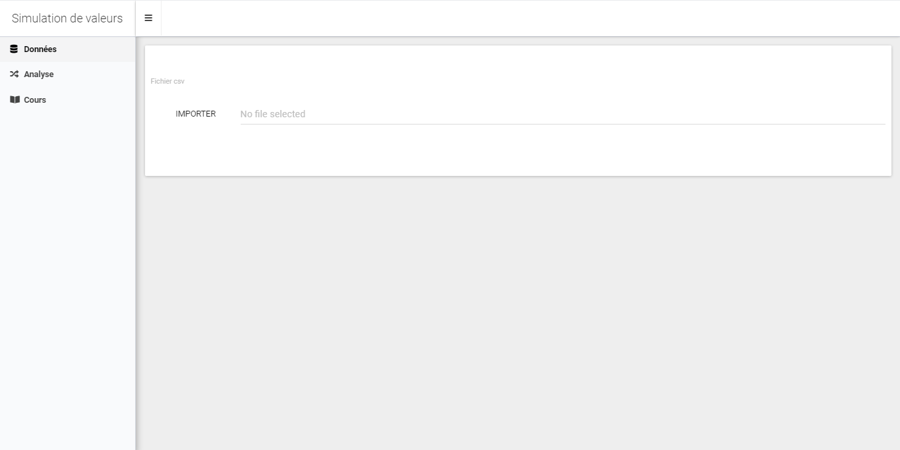

# Simulation de valeurs d'actifs

Voici un rapide dashboard pour ce cours, veuillez installer au préalable les library suivantes

```
pkg <- c("shinydashboardPlus", "shinydashboard", "plotly", "shinyWidgets", "DT", "shinycustomloader", "rtsdata", "waiter")
install.packages(pkg, dependencies = T)
```

Ouvrez le projet via le fichier `SimuActif.Rproj` 

Ensuite pour run l'application web, ouvrez soit le fichier `ui.R` ou `server.R` et cliquer sur le bouton `Run App` qui se trouve en haut à droite de la fenêtre.

Vous devriez avoir le résultat qui suit : 



Vous trouverez les fonctions dans le dossier R.

Pour plus d'informations concernant la création du dashboard : 

[Shiny](https://shiny.rstudio.com)

[shinydashboard](https://rinterface.github.io/shinydashboardPlus/)

## Arborescence du projet

```
- SimuActifs
  + www
    - images
    - html
    - css
    - js
  + data
    - data.csv
    - etc.
  + R
    - function1.R
    - ...
  - global.R
  - server.R
  - SimuActif.Rproj
  - ui.R
```

### Le dossier www

Comme son nom l'indique, c'est un dossier dans lequel il y a les documents pour le web

### Les fichiers pour shiny

- global.R
  1. Import les librairies requises
  2. source toutes le fonctions en R ou Python dans l'environnement global du projet
  
- ui.R
  C'est l'interface graphique du dashboard, i-e le front end
  
- server.R
  C'est le back end, c'est ce fichier que les fonctions seront utilisées
