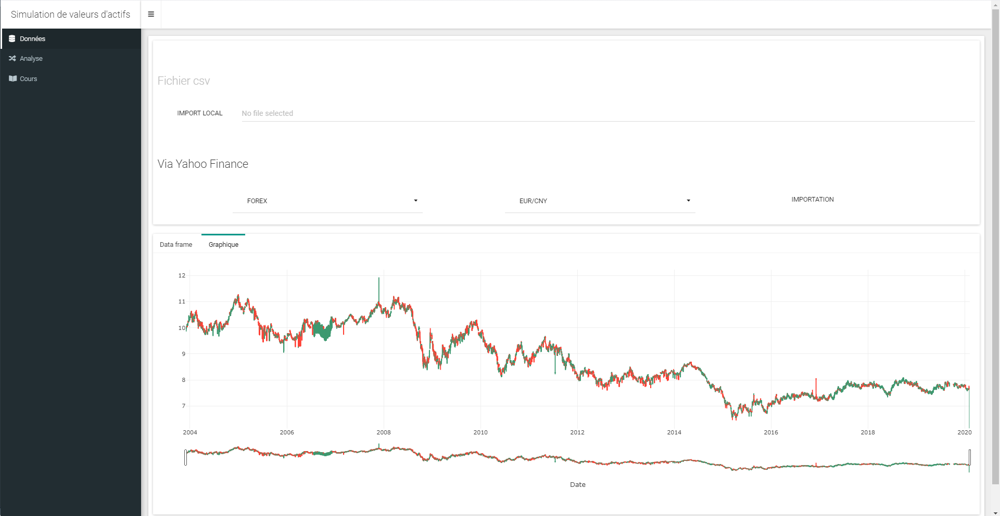

# Simulation de valeurs d'actifs

Voici un rapide dashboard pour ce cours, veuillez installer au préalable les library suivantes

```
pkg <- c("shinydashboardPlus", "shinydashboard", "plotly", "shinyWidgets", "DT", "shinycustomloader")
install.package(pkg, dependencies = T)
```

Ouvrez le projet via le fichier `SimuActif.Rproj` 

Ensuite pour run l'application web, ouvrez soit le fichier `ui.R` ou `server.R` et cliquer sur le bouton `Run App` qui se trouve en haut à droite de la fenêtre.

Vous devriez avoir le résultat qui suit : 



Vous trouverez les fonctions dans le dossier R.

Pour plus d'informations concernant la création du dashboard : 

[Shiny](https://shiny.rstudio.com)

[shinydashboard](https://rinterface.github.io/shinydashboardPlus/)